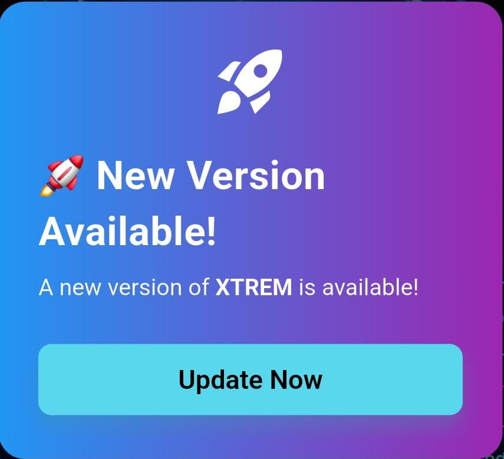

# Flutter App Update Manager

A powerful Flutter package to easily manage in-app updates using Firebase Firestore with multiple dialog styles and custom dialog support.


## Features

*   **Automatic Update Checks**: Automatically checks for new app versions from Firebase Firestore.
*   **Customizable Update Dialog**: Easily customize the update dialog to match your app's UI.
*   **Force and Optional Updates**: Configure updates to be either mandatory (force update) or optional.
*   **Platform-Specific Configuration**: Separate update configurations for Android and iOS.
*   **Auto Setup**: Automatically create Firestore structure with a single parameter.
*   **Modern Dialog Design**: Beautiful blur background with proper force update handling.
*   **Management Screen**: Built-in screen for managing update configurations.

## Screenshots

### Dialog Styles

| Default Dialog | Modern Dialog |
|----------------|---------------|
|  |  |

| Material Dialog | Custom Dialog |
|-----------------|---------------|
|  |  |

## Installation

Add this to your `pubspec.yaml`:

```yaml
dependencies:
  flutter_app_update_manager: ^0.1.1
```

## Quick Start

### 1. Basic Usage

```dart
import 'package:flutter_app_update_manager/flutter_app_update_manager.dart';

// Simple usage
AppUpdateManager(
  context: context,
  androidId: 'com.example.myapp',
  iosId: '123456789',
  appName: "MyApp",
).checkForUpdate();
```

### 2. With Custom Dialog Style

```dart
AppUpdateManager(
  context: context,
  androidId: 'com.example.myapp',
  iosId: '123456789',
  appName: "XTREM",
  dialogStyle: DialogStyle.modernStyle, // or DialogStyle.materialStyle
).checkForUpdate();
```

### 3. With Custom Dialog

```dart
AppUpdateManager(
  context: context,
  androidId: 'com.example.myapp',
  iosId: '123456789',
  appName: "XTREM",
  dialogStyle: DialogStyle.custom,
  customDialog: MyCustomDialog(),
).checkForUpdate();
```

## API Reference

### AppUpdateManager Class

The main class for managing app updates with Firebase Firestore integration.

#### Constructor

```dart
AppUpdateManager({
  required BuildContext context,
  String? androidId,
  String? iosId,
  String? appName,
  FirebaseFirestore? firestore,
  bool autoSetup = false,
  DialogStyle dialogStyle = DialogStyle.defaultStyle,
  CustomUpdateDialog? customDialog,
})
```

#### Parameters

| Parameter | Type | Required | Default | Description |
|-----------|------|----------|---------|-------------|
| `context` | `BuildContext` | ✅ | - | **The build context** - Used to show dialogs and detect platform. Must be a valid context from a MaterialApp widget tree. |
| `androidId` | `String?` | ❌ | `null` | **Android package ID** - Your app's package name (e.g., 'com.example.myapp'). Can also be configured in Firestore for centralized management. |
| `iosId` | `String?` | ❌ | `null` | **iOS App Store ID** - Your app's numeric ID from the App Store (e.g., '123456789'). Can also be configured in Firestore. |
| `appName` | `String?` | ❌ | `null` | **App name for dialogs** - The name to display in update dialogs (e.g., "MyApp"). Falls back to "App" if not provided. |
| `firestore` | `FirebaseFirestore?` | ❌ | `FirebaseFirestore.instance` | **Custom Firestore instance** - Use this to provide a custom Firestore instance for testing or different environments. |
| `autoSetup` | `bool` | ❌ | `false` | **Auto setup Firestore** - When true, creates the required Firestore structure with sample data. ⚠️ Set to false after first run to prevent data overwrites. |
| `dialogStyle` | `DialogStyle` | ❌ | `DialogStyle.defaultStyle` | **Dialog appearance** - Choose from predefined styles or use custom. See DialogStyle enum for options. |
| `customDialog` | `CustomUpdateDialog?` | ❌ | `null` | **Custom dialog implementation** - Your own dialog widget. Required when dialogStyle is DialogStyle.custom. |

#### Methods

##### `checkForUpdate()`

Checks for available updates by comparing the current app version with versions stored in Firebase Firestore.

```dart
Future<void> checkForUpdate()
```

**Returns:** `Future<void>` - Completes when the update check is finished

**Behavior:**
- Fetches current app version using `package_info_plus`
- Detects platform (Android/iOS) automatically
- Queries Firestore for available versions
- Shows update dialog if exact version match is found
- Handles force updates and optional updates
- Launches store URL when user chooses to update

### DialogStyle Enum

Defines the available dialog styles for update notifications.

```dart
enum DialogStyle {
  defaultStyle,    // Classic AlertDialog with clean design
  modernStyle,     // Modern rounded dialog with icons
  materialStyle,   // Material Design 3 inspired style
  custom,          // Custom dialog implementation
}
```

#### Values

| Value | Description | Visual Style |
|-------|-------------|--------------|
| `defaultStyle` | **Classic AlertDialog** - Simple, clean design with standard Material Design buttons | Standard AlertDialog with title, content, and action buttons |
| `modernStyle` | **Modern rounded dialog** - Enhanced with icons, better typography, and rounded corners | Rounded corners, update icon, improved spacing and typography |
| `materialStyle` | **Material Design 3** - Latest Material Design with gradient backgrounds and enhanced visuals | Material 3 styling with gradients, larger icons, and modern button styles |
| `custom` | **Custom implementation** - Use your own dialog widget | Fully customizable - implement CustomUpdateDialog interface |

### CustomUpdateDialog Interface

Abstract interface for creating custom update dialogs.

```dart
abstract class CustomUpdateDialog {
  Widget build(BuildContext context, {
    required bool isForceUpdate,
    required String appName,
    required VoidCallback onUpdate,
    required VoidCallback? onLater,
  });
}
```

#### Parameters

| Parameter | Type | Required | Description |
|-----------|------|----------|-------------|
| `context` | `BuildContext` | ✅ | **Build context** - Used for navigation and theme access |
| `isForceUpdate` | `bool` | ✅ | **Force update flag** - True when update is mandatory (hide "Later" button) |
| `appName` | `String` | ✅ | **App name** - The app name to display in the dialog |
| `onUpdate` | `VoidCallback` | ✅ | **Update callback** - Call this when user chooses to update |
| `onLater` | `VoidCallback?` | ✅ | **Later callback** - Call this when user chooses to update later (null if force update) |

#### Implementation Example

```dart
import 'package:flutter/material.dart';
import 'package:flutter_app_update_manager/flutter_app_update_manager.dart';

class MyCustomDialog implements CustomUpdateDialog {
  @override
  Widget build(
    BuildContext context, {
    required bool isForceUpdate,
    required String appName,
    required VoidCallback onUpdate,
    required VoidCallback? onLater,
  }) {
    return Dialog(
      child: Container(
        padding: EdgeInsets.all(24),
        decoration: BoxDecoration(
          borderRadius: BorderRadius.circular(16),
          gradient: LinearGradient(colors: [Colors.blue, Colors.purple]),
        ),
        child: Column(
          mainAxisSize: MainAxisSize.min,
          children: [
            Icon(Icons.rocket_launch, size: 48, color: Colors.white),
            SizedBox(height: 16),
            Text(
              '🚀 New Version Available!',
              style: TextStyle(fontSize: 24, fontWeight: FontWeight.bold),
            ),
            SizedBox(height: 8),
            Align(
              alignment: Alignment.centerLeft,
              child: RichText(
                textAlign: TextAlign.start,
                text: TextSpan(
                  children: [
                    TextSpan(text: 'A new version of '),
                    TextSpan(
                      text: appName,
                      style: TextStyle(fontWeight: FontWeight.bold),
                    ),
                    TextSpan(text: ' is available!'),
                  ],
                ),
              ),
            ),
            SizedBox(height: 24),
            Row(
              children: [
                if (!isForceUpdate && onLater != null)
                  Expanded(
                    child: OutlinedButton(
                      onPressed: onLater,
                      child: Text('Maybe Later'),
                    ),
                  ),
                Expanded(
                  child: ElevatedButton(
                    onPressed: onUpdate,
                    child: Text('Update Now'),
                  ),
                ),
              ],
            ),
          ],
        ),
      ),
    );
  }
}
```

## Firebase Firestore Setup

### Auto Setup (Recommended for First Time)

```dart
AppUpdateManager(
  context: context,
  androidId: 'com.example.myapp',
  iosId: '123456789',
  appName: "XTREM",
  autoSetup: true, // Set to false after first run
).checkForUpdate();
```

### Manual Firestore Structure

Create a collection named `AppUpdateManager` with documents for each platform:

#### Document Structure

**Simplified Structure (Recommended):**

```json
{
  "versions": [
    {
      "version": "0.0.1+1",
      "forceUpdate": true
    },
    {
      "version": "0.0.2+1",
      "forceUpdate": false
    }
  ]
}
```

**Original Structure (Legacy):**

```json
{
  "versions": [
    {
      "version": "0.0.2+1",
      "forceUpdate": false
    }
  ]
}
```

## Firestore Configuration

### App IDs Configuration

You can configure your app IDs in two ways:

1. **In your code** (as before):
   ```dart
   AppUpdateManager(
     context: context,
     androidId: 'com.example.myapp',
     iosId: '123456789',
   ).checkForUpdate();
   ```

2. **In Firestore** (recommended for centralized management):
   - Add `androidId` and `iosId` fields to your Firestore documents
   - The package will use Firestore values if available, otherwise fall back to code values
   - This allows you to update app IDs without releasing a new app version

## Version Management

### Simplified Structure Benefits

The simplified structure makes version management much easier:

- **Exact version matching**: Only shows dialog when version+build number exactly matches
- **Simple configuration**: Each version has just `version` and `forceUpdate` fields
- **Easy to manage**: Just add versions to the array when you want to show the dialog
- **Clear logic**: If version exists in Firestore, show dialog; otherwise, don't

### Version Format

Versions should follow the format: `major.minor.patch+build` (e.g., `1.0.0+1`)

- **Flexible matching**: Supports both formats
  - `1.0.0+1` (with build number) - exact match required
  - `1.0.0` (without build number) - matches version part only
- **Force update**: When `forceUpdate: true`, dialog cannot be dismissed
- **Optional update**: When `forceUpdate: false`, shows "Later" button and dialog is dismissible

**Examples:**
- App version `0.0.1+1` + Firestore `0.0.1+1` → **Dialog shows**
- App version `0.0.1+1` + Firestore `0.0.1` → **Dialog shows** (version part matches)
- App version `0.0.1` + Firestore `0.0.1+1` → **Dialog shows** (version part matches)
- App version `0.0.1+1` + Firestore `0.0.2` → **No dialog** (no match)

## Example App

Run the example app to see all dialog styles in action:

```bash
cd example
flutter run
```

The example app demonstrates:
- All dialog styles
- Custom dialog implementation
- App name customization
- Force update scenarios

## Getting Started Guide

### Step 1: Initial Setup

1. **Add the package to your `pubspec.yaml`**
2. **Run `flutter pub get`**
3. **Configure Firebase in your project**

### Step 2: First Run with Auto Setup

```dart
void main() {
  runApp(MyApp());
}

class MyApp extends StatelessWidget {
  @override
  Widget build(BuildContext context) {
    return MaterialApp(
      home: MyHomePage(),
    );
  }
}

class MyHomePage extends StatefulWidget {
  @override
  _MyHomePageState createState() => _MyHomePageState();
}

class _MyHomePageState extends State<MyHomePage> {
  @override
  void initState() {
    super.initState();
    
    // First run with auto setup
    AppUpdateManager(
      context: context,
      androidId: 'com.example.myapp',
      iosId: '123456789',
      appName: "App Name",
      autoSetup: true, // ⚠️ Set to false after first run
    ).checkForUpdate();
  }

  @override
  Widget build(BuildContext context) {
    return Scaffold(
      appBar: AppBar(title: Text('My App')),
      body: Center(child: Text('Welcome To My App')),
    );
  }
}
```

### Step 3: Configure Firestore

After the first run with `autoSetup: true`:

1. **Go to Firebase Console**
2. **Navigate to Firestore**
3. **Find the `AppUpdateManager` collection**
4. **Update the versions with your actual app versions**
5. **Set `autoSetup: false` in your code**

### Step 4: Add New Versions

When you release a new version:

1. **Update your app's version in `pubspec.yaml`**
2. **Add the new version to Firestore**
3. **Configure force update if needed**

Example Firestore update:
```json
{
  "versions": [
    {
      "version": "1.0.0",
      "forceUpdate": true
    },
    {
      "version": "1.1.0",
      "forceUpdate": false
    },
    {
      "version": "1.2.0",
      "forceUpdate": false
    }
  ]
}
```

### Implementation

In your app, import the package and initialize the `AppUpdateManager` in your `initState` or any other suitable place:

```dart
import 'package:flutter_app_update_manager/flutter_app_update_manager.dart';

@override
void initState() {
  super.initState();
  AppUpdateManager(
    context: context,
    androidId: 'your.android.app.id',
    iosId: 'your.ios.app.id',
    showLaterButton: true, // Show "Later" button for optional updates
    appName: "MyApp",
    autoSetup: true, // Remove this after first run
  ).checkForUpdate();
}
```

**How it works:**
- If your app version is `0.0.1+1` and Firestore has `{"version": "0.0.1+1", "forceUpdate": true}`, dialog shows
- If your app version is `0.0.1+1` and Firestore has `{"version": "0.0.1+0", "forceUpdate": false}`, no dialog
- If your app version is `0.0.1+1` and Firestore has `{"version": "0.0.0+1", "forceUpdate": false}`, no dialog

### Management Screen

The package includes a built-in management screen for configuring update settings:

```dart
// Navigate to the management screen
Navigator.push(
  context,
  MaterialPageRoute(
    builder: (context) => AppUpdateManagerScreen(),
  ),
);
```

The management screen provides:
- **Platform-specific tabs** (Android/iOS)
- **Version management** with force update controls
- **App store URL configuration**
- **Real-time Firestore synchronization**
- **Modern UI** with smooth animations

## Contributing

Contributions are welcome! Please feel free to submit a Pull Request.

## License

This project is licensed under the MIT License - see the [LICENSE](LICENSE) file for details.

## Support

If you encounter any issues or have questions, please open an issue on GitHub.

### Customization

You can customize the update dialog by passing additional parameters to the `AppUpdateManager` constructor:

```dart
AppUpdateManager(
  context: context,
  androidId: 'your.android.app.id',
  iosId: 'your.ios.app.id',
  showLaterButton: true, // Show a "Later" button for optional updates
  appName: 'My Awesome App', // Your app's name
  playStoreUrl: 'https://play.google.com/store/apps/details?id=your.android.app.id', // Custom Play Store URL
  appStoreUrl: 'https://apps.apple.com/app/id-your.ios.app.id', // Custom App Store URL
  autoSetup: false, // Set to false after initial setup
  dialogStyle: DialogStyle.modernStyle, // Choose dialog style
).checkForUpdate();
```

### Dialog Styles

The package supports multiple dialog styles:

```dart
// Default style - Classic AlertDialog
dialogStyle: DialogStyle.defaultStyle

// Modern style - Enhanced design with blur background
dialogStyle: DialogStyle.modernStyle

// Material style - Material Design 3 inspired
dialogStyle: DialogStyle.materialStyle

// Custom style - Your own implementation
dialogStyle: DialogStyle.custom
```

### Custom Dialog Implementation

Create your own dialog by implementing `CustomUpdateDialog`:

```dart
class MyCustomDialog implements CustomUpdateDialog {
  @override
  Widget build(BuildContext context, {
    required bool isForceUpdate,
    required String appName,
    required VoidCallback onUpdate,
    required VoidCallback? onLater,
  }) {
    return AlertDialog(
      title: Text('Custom Update Dialog'),
      content: Text('Update $appName now?'),
      actions: [
        if (onLater != null)
          TextButton(onPressed: onLater, child: Text('Later')),
        ElevatedButton(onPressed: onUpdate, child: Text('Update')),
      ],
    );
  }
}

// Use custom dialog
AppUpdateManager(
  context: context,
  dialogStyle: DialogStyle.custom,
  customDialog: MyCustomDialog(),
).checkForUpdate();
```

## Additional Information

*   **Contributing**: Contributions are welcome! Please feel free to submit a pull request.
*   **Issues**: If you find any issues or have a feature request, please file an issue on our [GitHub repository](https://github.com/your-repo-link).
*   **License**: This package is licensed under the MIT License.

---

## Author

<div align="center">
  
  
  **Muzamil Ghafoor**
  
  Flutter Developer | Passionate About Crafting Seamless Apps With Flutter & Dart
  
  [](https://github.com/muzzammil763)
  [](https://www.linkedin.com/in/muzamil-ghafoor-181840344?utm_source=share&utm_campaign=share_via&utm_content=profile&utm_medium=ios_app)
  
  
  
  
</div>